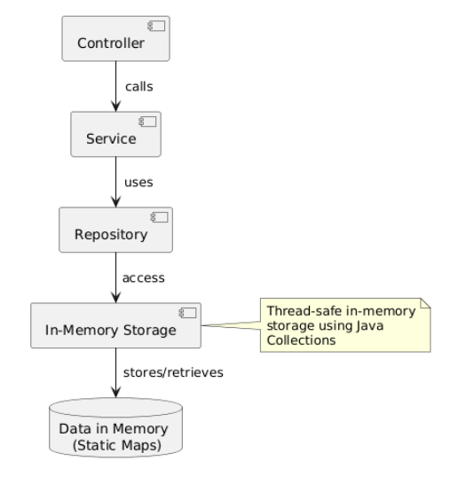
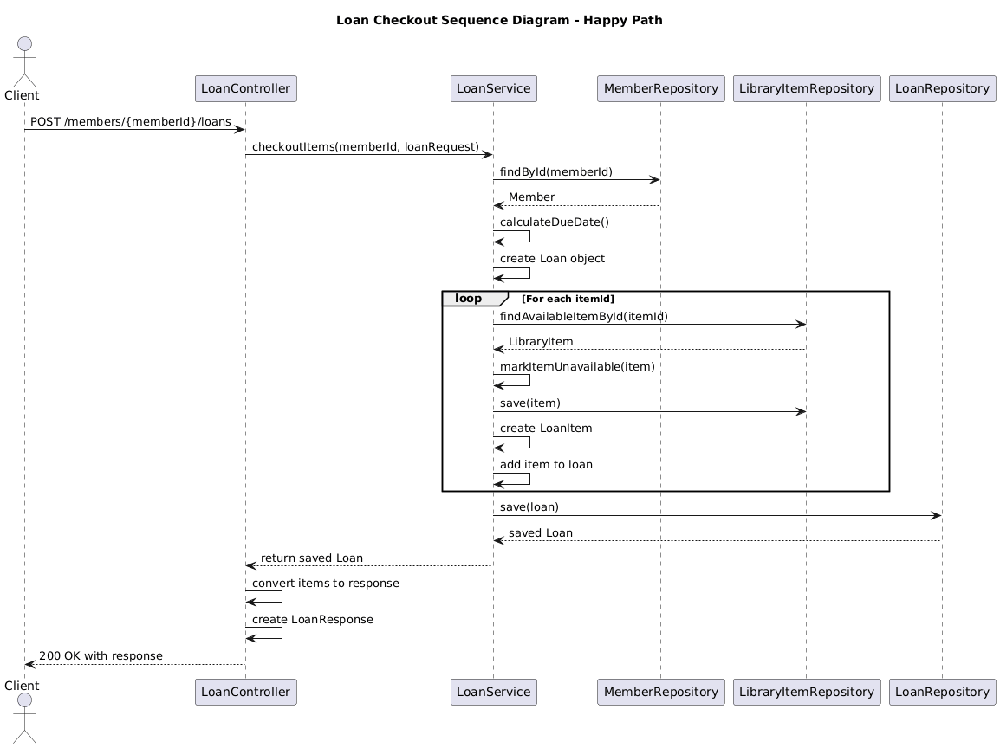

# 📚 Library Management Service

A **Spring Boot 3** REST API that allows members to borrow and return library items such as **books** and **journals**.  
The system demonstrates solid object-oriented design, modern **Java 25** features, and an in-memory persistence layer — no external database required.

---

## 🧭 Project Overview

### 🎯 Purpose
The **Library Management Service** provides RESTful endpoints for managing loans, members, and library items.  
It allows members to:
- Borrow one or multiple available books or journals.
- Return selected or all borrowed items.
- View current and past loans with item details.

### ⚙️ Main Features
- Checkout items and track due dates.
- Return single or all items in a loan.
- In-memory repositories (no database setup needed).
- Auto-initialized sample data (members, books, journals).
- Centralized exception handling and structured error responses.
- Java 25 modern syntax (sealed classes, records, lambdas).

### 🏗️ Architecture Overview
This API follows a **three-layer architecture**:



Each layer has a clear responsibility:
- **Controller**: Handles HTTP requests and responses.
- **Service**: Contains business logic for borrowing and returning items.
- **Repository**: Manages in-memory storage using static maps.

---

## 🧩 UML Diagrams

### 🧱 Class Diagram


---

### 🔁 Sequence Diagram

#### Borrow Flow


#### Return Flow


---

## 🌐 API Documentation

### 🔗 Swagger OpenAPI Documentation

The application provides interactive API documentation using SpringDoc OpenAPI 3.

📍 Access Points
- Swagger UI: http://localhost:8080/swagger-ui.html
- OpenAPI JSON: http://localhost:8080/api-docs
- OpenAPI YAML: http://localhost:8080/api-docs.yaml

#### ⚙️ Configuration

The OpenAPI documentation is configured in application.yml:
```yaml
springdoc:
  api-docs:
    path: /api-docs
    groups:
      enabled: true
  swagger-ui:
    path: /swagger-ui.html
    operationsSorter: method
    tagsSorter: alpha
    disable-swagger-default-url: true
```
#### 📋 Features
- Interactive Testing: Execute API calls directly from the browser
- Schema Documentation: Complete request/response model documentation
- Error Responses: All possible HTTP status codes and error formats
- Parameter Documentation: Detailed parameter descriptions and examples

## 🚀 API Endpoints

### 1️⃣ **Checkout Items**
**POST** `/v1/members/{memberId}/loans`

Create a new loan for a member by borrowing one or more available items.

#### Request Example
```json
{
  "items": [1, 2]
}
```

#### Success Response
```json
{
  "id": 1,
  "memberId": 1,
  "loanDate": "2025-10-25",
  "expectedReturnDate": "2025-11-08",
  "items": [
    { "id": 1, "title": "Clean Code", "type": "BOOK", "returnedDate": null },
    { "id": 2, "title": "Nature Neuroscience", "type": "JOURNAL", "returnedDate": null }
  ],
  "status": "OPEN"
}
```

#### Error Example
```json
{
  "timestamp": "2025-10-25T15:30:00",
  "status": 409,
  "error": "Conflict",
  "message": "Item 'Clean Code' is currently loaned out",
  "path": "/v1/members/1/loans"
}
```

---

### 2️⃣ **List Member Loans**
**GET** `/v1/members/{memberId}/loans`

Retrieve a summary of all loans for a member.

#### Success Response
```json
[
  {
    "loanId": 1,
    "loanDate": "2025-10-25",
    "expectedReturnDate": "2025-11-08",
    "status": "OPEN"
  }
]
```

---

### 3️⃣ **Get Loan Details**
**GET** `/v1/loans/{loanId}`

Fetch detailed information about a specific loan and its items.

#### Success Response
```json
{
  "id": 1,
  "memberId": 1,
  "loanDate": "2025-10-25",
  "expectedReturnDate": "2025-11-08",
  "items": [
    { "id": 1, "title": "Clean Code", "type": "BOOK", "returnedDate": null }
  ],
  "status": "OPEN"
}
```

---

### 4️⃣ **Return Items**
**POST** `/v1/loans/{loanId}/returns`

Return one or more items, or all if no body is provided.

#### Request Example (specific items)
```json
{
  "items": [1]
}
```

#### Response Example (loan closed)
```json
{
  "id": 1,
  "memberId": 1,
  "loanDate": "2025-10-25",
  "expectedReturnDate": "2025-11-08",
  "items": [
    { "id": 1, "title": "Clean Code", "type": "BOOK", "returnedDate": "2025-10-30" }
  ],
  "status": "CLOSED"
}
```


---

## 📚 Generating Javadoc
The project includes comprehensive Javadoc documentation for all classes, methods, and records.

### 🛠️ Generate Documentation

```bash
# Generate Javadoc
mvn javadoc:javadoc

# View generated documentation
open target/site/apidocs/index.html
```

### 📖 Access Javadoc
After generation, open target/site/apidocs/index.html in your browser to view:

- Class Documentation: Detailed descriptions of all entities, services, and controllers
- Method Documentation: Complete parameter and return value documentation
- Record Documentation: DTO field descriptions and usage examples
- Exception Documentation: When and why each exception is thrown
- Inheritance Trees: Class hierarchy and implementation relationships

### 📋 Javadoc Features

- Complete Coverage: All public and protected methods documented
- Cross-References: @see tags linking related classes and methods
- Parameter Validation: Documentation of constraints and validation rules
- Exception Handling: Detailed @throws documentation
- Return Value Descriptions: Clear explanations of what each method returns

---


## 🧠 Object-Oriented Design Explanation

| Principle         | Description                                     | Example                                     |
|-------------------|-------------------------------------------------|---------------------------------------------|
| **Encapsulation** | Data hidden behind getters/setters              | `LibraryItem` fields are private            |
| **Inheritance**   | Common behavior in base classes                 | `Book` and `Journal` extend `LibraryItem`   |
| **Polymorphism**  | Shared interface with different implementations | `getType()` returns `"BOOK"` or `"JOURNAL"` |
| **Abstraction**   | Abstract parent defines contract                | `LibraryItem` is an abstract sealed class   |
| **Interfaces**    | Business contracts                              | `LoanService` defines loan operations       |

---

## ☕ Advanced Java Features

| Feature               | Example                                                                     | Description                             |
|-----------------------|-----------------------------------------------------------------------------|-----------------------------------------|
| **Sealed Classes**    | `public sealed abstract class LibraryItem permits Book, Journal {}`         | Restricts subclassing for type safety   |
| **Records**           | `public record LoanResponse(...) {}`                                        | Compact immutable data transfer objects |
| **Lambdas & Streams** | `.stream().map(...).toList()`                                               | Used for transforming lists of entities |

---

## 🚀 Java 25 Features Utilized

| JEP         | Feature                                | Example in Code                                           |
|-------------|----------------------------------------|-----------------------------------------------------------|
| **JEP 513** | Flexible Constructor Bodies            | `Book` class constructor with validation before `super()` |
| **JEP 512** | Compact Source Files and Instance Main | `Application` class with simplified `main()` method       |

### 🔧 Code Examples

**JEP 513**: Flexible Constructor Bodies 
```java
public class Book extends LibraryItem {
    public Book(String title, String author, LocalDate publicationDate, String isbn, String genre, int pageCount) {
        super(title, author, publicationDate);
        if (pageCount <= 0) {
            throw new IllegalArgumentException("Page count must be positive");
        }
        this.isbn = isbn;
        this.genre = genre;
        this.pageCount = pageCount;
    }
}
``` 

**JEP 512**: Compact Source Files and Instance Main
```java
@SpringBootApplication
public class LibraryManagementApplication {
    public static void main(String[] args) {
        SpringApplication.run(LibraryManagementApplication.class, args);
    }
}
``` 


---

## 💾 In-Memory Data Management

This project replaces JPA/H2 with a **thread-safe in-memory approach**:
- Uses `ConcurrentHashMap` as storage for each repository.
- Uses `AtomicLong` to auto-generate IDs.
- Loads mock data via `@PostConstruct`:
    - **3 members:** Alice, Bob, Charlie
    - **3 books:** *Clean Code*, *Effective Java*, *The Pragmatic Programmer*
    - **2 journals:** *Nature Neuroscience*, *IEEE Transactions on Computers*

Example repository initialization:
```java
@PostConstruct
public void init() {
    save(new Member("Alice", "Johnson", "alice@example.com"));
    save(new Member("Bob", "Williams", "bob@example.com"));
}
```

---

## 🚀 Running the Application

### Prerequisites
- Java 25+
- Maven 3.9+

### Run Command
```bash
mvn spring-boot:run
```

### Default Endpoint
```
http://localhost:8080/v1
```

---

## 🧾 License
This project is for educational and demonstration purposes — showing **clean architecture, Java 25 features, and OOP principles** in a Spring Boot REST API.
